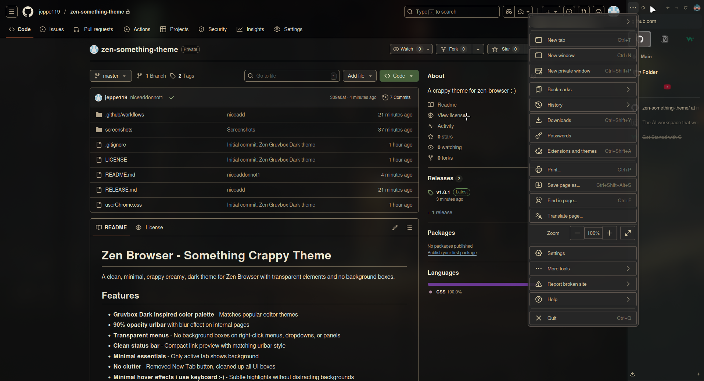

# Zen Browser - Gruvbox Dark Theme

A clean, minimal Gruvbox dark theme for Zen Browser with transparent elements and no background boxes.

## Features

- **Gruvbox Dark color palette** - Matches popular editor themes
- **90% opacity urlbar** with blur effect on internal pages
- **Transparent menus** - No background boxes on right-click menus, dropdowns, or panels
- **Clean status bar** - Compact link preview with matching urlbar style
- **Minimal essentials** - Only active tab shows background
- **No clutter** - Removed New Tab button, cleaned up all UI boxes
- **Smooth hover effects** - Subtle highlights without distracting backgrounds

## Color Palette

Based on the Gruvbox Dark theme:

- **Background:** `#191c1c` (custom darker variant)
- **Darker areas:** `#1d2021`
- **Foreground:** `#ebdbb2`
- **Accent colors:**
  - Red: `#fb4934`
  - Green: `#b8bb26`
  - Yellow: `#fabd2f`
  - Blue: `#83a598`
  - Purple: `#d3869b`
  - Aqua: `#8ec07c`
  - Orange: `#fe8019`
  - Gray: `#928374`

## Installation

### 1. Enable userChrome.css support

1. Open Zen Browser
2. Type `about:config` in the address bar and press Enter
3. Search for `toolkit.legacyUserProfileCustomizations.stylesheets`
4. Set it to `true` (double-click to toggle)

### 2. Locate your Zen profile directory

1. Type `about:support` in the address bar
2. Find "Profile Directory" and click "Open Directory"
3. You should see a folder path like: `~/.zen/[random-string].Default/`

### 3. Install the theme

1. In your profile directory, create a `chrome` folder if it doesn't exist
2. Copy `userChrome.css` into the `chrome` folder
3. The final path should look like: `~/.zen/[profile]/chrome/userChrome.css`

### 4. Restart Zen Browser

Close and reopen Zen Browser to see the theme applied.

## Optional: Enable blur effects on internal pages

The theme includes backdrop blur effects that work on Zen's internal pages (settings, about pages). To enable:

1. Go to `about:config`
2. Search for `layout.css.backdrop-filter.enabled`
3. Set it to `true`

**Note:** Backdrop blur cannot work over web content due to browser security architecture. The urlbar will have a solid 90% opacity background on regular websites.

## Screenshots

### GitHub Repository

*Clean GitHub interface with Gruvbox colors*

### URL Dropdown Search

*Transparent dropdown with no background boxes*

### Context Menu

*Clean right-click menu with transparent background*

### Hamburger Menu

*Browser menu with clean styling*

### Downloads Panel

*Transparent downloads panel*

### YouTube

*YouTube with 90% opacity urlbar*

### Other Websites

 -> ALL SCREENSHOTS TAKEN WITH DARKREADER ON <-
## Compatibility

- **Browser:** Zen Browser (Firefox-based)
- **Tested on:** Linux
- **Dark Reader:** Fully compatible

## Customization

### Adjusting urlbar opacity

Find this section in `userChrome.css`:

```css
/* Nuclear option - remove ALL urlbar backgrounds but keep blur */
#urlbar,
#urlbar-background {
    background-color: rgba(29, 32, 33, 0.9) !important;
```

Change `0.9` to any value between `0.0` (fully transparent) and `1.0` (fully opaque).

### Changing colors

All color variables are defined at the top of the file in the `:root` section. Modify these to match your preferences:

```css
:root {
    --custom-bg-dark: #191c1c;
    --custom-fg1: #ebdbb2;
    /* ... etc */
}
```

## Known Limitations

- Backdrop blur only works on internal Zen pages, not on web content (Firefox/Zen security limitation)
- Some UI elements may need adjustment depending on your Zen Browser version
- Tested primarily on Linux; Windows/macOS may require minor tweaks

## Contributing

Found a bug or want to improve the theme? Feel free to:

- Open an issue
- Submit a pull request
- Share screenshots of your setup

## License

MIT License - Feel free to modify and distribute!

## Credits

- Theme created for Zen Browser
- Inspired by the Gruvbox color scheme by morhetz
- Built with help from Claude (Anthropic)
